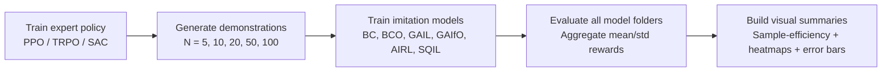
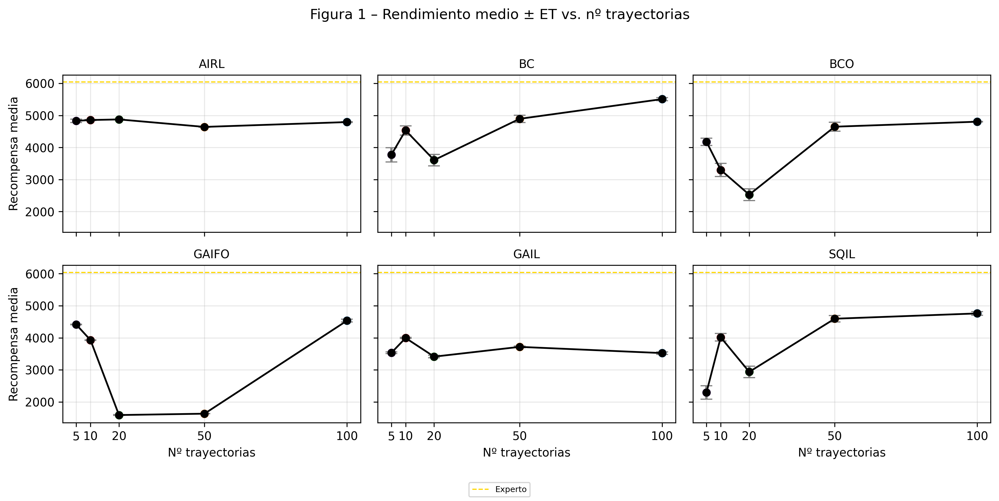
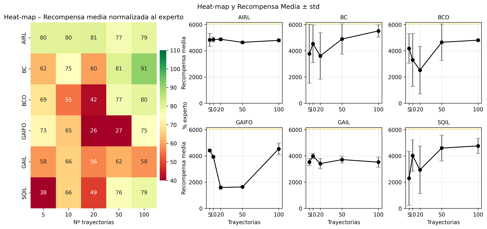

# Imitation Learning Benchmark for Continuous & Discrete Control

<p align="left">
  Comparative study of <strong>6 imitation learning algorithms</strong> under a unified protocol on <code>CartPole-v1</code> and <code>HalfCheetah-v4</code>.<br/>
  Designed as a reproducible research-engineering project: from expert training and demonstration generation to automated evaluation and publication-ready figures.
</p>

<p align="left">
  
  
  
  
  
  
</p>

---

## At a glance

| Area | Details |
|---|---|
| **Project type** | Comparative imitation learning benchmark under a common training/evaluation protocol |
| **Algorithms (6)** | **BC, BCO, GAIL, GAIfO, AIRL, SQIL** |
| **Environments** | **CartPole-v1** (discrete) and **HalfCheetah-v4** (continuous) |
| **Key engineering contribution** | **From-scratch continuous-control implementations of BCO, GAIfO, SQIL** |
| **Main comparison setup** | Demonstration budgets: **5, 10, 20, 50, 100** trajectories; main training budget: **2M steps** |
| **Headline findings** | BC peaks at **91.2%** of expert (100 demos); AIRL is most stable at ~**80%** across budgets |
| **Core stack** | Python, Gymnasium, PyTorch, Stable-Baselines3, sb3-contrib, imitation, pandas, matplotlib, seaborn |

---

## Environment preview

| CartPole-v1 | HalfCheetah-v4 |
|---|---|
|  |  |

---

## Why this project matters

In reinforcement learning, **reward engineering is often the bottleneck**: designing a reward that is correct, robust, and not exploitable can be harder than training the policy itself.

Imitation learning is a practical alternative, but the field is fragmented across families (supervised cloning, inverse-dynamics methods, adversarial methods, and offline-RL-style approaches). This repository addresses that gap by comparing representative methods **under one consistent experimental protocol**, making trade-offs easier to analyze and reproduce.

---

## Core contributions

- **Unified benchmark across 6 IL algorithms** with shared demonstration budgets and evaluation criteria.
- **From-scratch implementations for continuous control**:
  - **BCO** with custom inverse-dynamics learning,
  - **GAIfO** with state-only adversarial training,
  - **SQIL** with a custom SAC-style agent.
- **End-to-end experimental pipeline**:
  expert policy training → demonstration generation → imitation training → model-wide evaluation → figure generation.
- **Reproducibility-oriented structure** with dedicated config files, centralized data/model folders, and analysis scripts.

> [!NOTE]
> BC, GAIL, and AIRL rely on established components from the `imitation` ecosystem and SB3/sb3-contrib. BCO, GAIfO, and SQIL include custom algorithmic implementations in this repo.

---

## Repository architecture

```text
.
├── README.md
└── Code/
    ├── AIRL/                      # AIRL training/evaluation scripts + saved runs
    ├── BC/                        # Behavioral Cloning scripts + saved runs
    ├── BCO/                       # Custom BCO implementation (inverse dynamics + policy)
    ├── GAIL/                      # GAIL training/evaluation scripts
    ├── GAIfO/                     # Custom GAIfO implementation (state-only adversarial)
    ├── SQIL/                      # Custom SQIL implementation (SAC-style actor/critic)
    ├── config/                    # YAML experiment parameter files
    ├── data/
    │   ├── experts/               # Trained expert policies
    │   └── demonstrations/        # Demonstrations grouped by trajectory count
    ├── figures/                   # Generated visual outputs (sample-efficiency, heatmaps, etc.)
    ├── train_expert.py            # Expert policy training (PPO/TRPO/SAC)
    ├── generate_demonstrations.py # Demonstration rollout/serialization
    ├── evaluate_every_model.py    # Cross-algorithm evaluation + aggregated export
    └── build_figures.py           # Figure generation (heatmaps + error-bar summaries)
```

---

## Experimental pipeline



### Stage breakdown

1. **Train experts** (`Code/train_expert.py`) with PPO/TRPO/SAC depending on environment/action space.
2. **Generate demonstrations** (`Code/generate_demonstrations.py`) from trained experts for selected trajectory budgets.
3. **Train imitation policies** in algorithm-specific modules (`Code/<ALGO>/train_*.py`).
4. **Evaluate every model folder automatically** (`Code/evaluate_every_model.py`) and export aggregated results.
5. **Generate figures** (`Code/build_figures.py`) including heatmaps and error-bar plots from summary files.

---

## Algorithms covered

| Algorithm | Family | Action access required? | From scratch in this repo? | Notes |
|---|---|---:|---:|---|
| **BC** | Supervised imitation | ✅ Yes | ❌ No | Uses `imitation.algorithms.bc` pipeline |
| **BCO** | Observation-only + inverse dynamics | ❌ No | ✅ Yes | Custom inverse-dynamics model + policy training loop |
| **GAIL** | Adversarial imitation | ✅ Yes | ❌ No | Uses `imitation` adversarial setup with SB3/TRPO learner |
| **GAIfO** | Adversarial (state-only) | ❌ No | ✅ Yes | Custom state-transition discriminator and training loop |
| **AIRL** | Adversarial IRL-style | ✅ Yes | ❌ No | Uses `imitation` AIRL components with TRPO generator |
| **SQIL** | Offline-RL-style imitation | ✅ Yes | ✅ Yes | Custom SAC-style actor/critic + demo/agent replay handling |

---

## Key results

| Finding | What it means |
|---|---|
| **BC reaches 91.2% of expert performance with 100 demonstrations.** | Pure behavior matching can be very effective in higher-demo regimes. |
| **AIRL is the most stable method (~80% expert) across trajectory budgets.** | AIRL offers strong robustness when demonstration count changes. |
| **Critical degradation zone around 20 trajectories.** | Several methods become less reliable in this intermediate data regime. |
| **Observation-only methods are more sensitive.** | Inferring behavior without action labels tends to increase difficulty/variance. |

This benchmark emphasizes **stability vs. peak performance**, not only single best scores.

### Generated outputs in this repo

<p align="left">
  
  
</p>

---

## Reproducibility — quickstart

```bash
# 1) Install dependencies
pip install -r Code/requirements.txt

# 2) Move into the code workspace
cd Code

# 3) Train an expert (example: HalfCheetah + SAC + 2M steps)
python train_expert.py --env halfcheetah --policy sac --timesteps 2000000 --seed 44

# 4) Generate demonstrations (example: 100 trajectories)
python generate_demonstrations.py --env halfcheetah --policy sac --timesteps 2000000 --num_episodes 100 --seed 44

# 5) Train one imitation method (example: BC)
python BC/train_bc.py --env halfcheetah --timesteps 2000000 --seed 44 --demo_episodes 100

# 6) Evaluate all trained models inside a root folder
python evaluate_every_model.py --root modelos_finales --episodes 100

# 7) Build figures from the aggregated summary
python build_figures.py --summary modelos_finales/eval_results_100eps.xlsx --episodes 100 --outdir figures
```

---

## Technical highlights

- **Custom algorithm engineering** for BCO, GAIfO, and SQIL in continuous control.
- **Model-specific modular folders** for cleaner experimentation and maintenance.
- **Automated cross-model evaluation** via folder scanning + unified result export.
- **Reproducible analytics pipeline** for sample-efficiency curves, heatmaps, and error bars.
- **Config-driven experimentation** using YAML files in `Code/config`.

---

## Project takeaways

This project demonstrates:

- Strong practical grounding in **reinforcement learning and imitation learning**.
- Ability to combine **research comparison design** with **real implementations**.
- Experience implementing both **library-based baselines** and **custom algorithm components**.
- Focus on **experimental rigor, reproducibility, and analysis tooling**.

---

## Future work

- Extend comparisons to additional continuous-control tasks.
- Increase seed coverage for tighter uncertainty estimates.
- Further standardize output schemas to simplify large-scale benchmarking.
