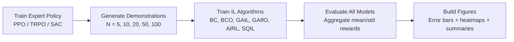

# Imitation Learning Under One Protocol: A Comparative Benchmark Across 6 Algorithms

A reproducible, end-to-end study of **imitation learning (IL)** in both discrete and continuous control. This project benchmarks **BC, BCO, GAIL, GAIfO, AIRL, and SQIL** under the same data budget and evaluation pipeline to surface practical trade-offs that matter in real RL workflows.

---

## At a Glance

| Area | Summary |
|---|---|
| **Project type** | Comparative experimental study in imitation learning |
| **Algorithms** | **6 total**: BC, BCO, GAIL, GAIfO, AIRL, SQIL |
| **Environments** | `CartPole-v1` and `HalfCheetah-v4` |
| **Main engineering contribution** | From-scratch continuous-control implementations of **BCO**, **GAIfO**, and **SQIL** |
| **Main experimental protocol** | Expert → demonstrations (`5/10/20/50/100`) → IL training (mainly **2M steps**) → standardized evaluation → figure generation |
| **Headline findings** | BC peaks at **91.2%** expert with 100 demos; AIRL shows strongest cross-budget stability (~80% expert); many methods dip around **20 demonstrations** |
| **Core stack** | Python, Gymnasium, PyTorch, Stable-Baselines3, sb3-contrib, `imitation`, pandas, matplotlib, seaborn |

---

## Environment Preview

| CartPole-v1 | HalfCheetah-v4 |
|---|---|
|  |  |

*Environment visuals are sourced from the official Gymnasium documentation pages for the corresponding environments.*

## Why This Project Matters

In reinforcement learning, writing reward functions that are both correct and robust is often the hardest part of the problem. Imitation learning is a practical alternative: instead of handcrafting rewards, the agent learns from expert behavior.

The challenge is fragmentation: different IL families (supervised, inverse-dynamics, adversarial, offline-RL flavored) are often evaluated with inconsistent settings. This repository addresses that by comparing multiple IL approaches under a **shared protocol**, making results easier to interpret and reproduce.

---

## Core Contributions

- **Unified benchmark across 6 imitation algorithms** on the same environments and trajectory budgets.
- **Custom continuous-control implementations** for:
  - **BCO** (including custom inverse-dynamics modeling),
  - **GAIfO** (state-only adversarial setup),
  - **SQIL** (custom SAC-style actor/critic agent).
- **Integrated research pipeline** from expert training to automated model evaluation and plotting.
- **Reproducible experiment structure** with configuration files (`Code/config/*.yaml`), standardized folder conventions, and scripts for aggregate analysis.

> [!NOTE]
> BC, GAIL, and AIRL are trained with the established `imitation` ecosystem and SB3-based components, while BCO, GAIfO, and SQIL include substantial custom implementations in this repo.

---

## Repository Architecture

```text
.
├── README.md
└── Code/
    ├── AIRL/                  # AIRL training, evaluation, iterative runs
    ├── BC/                    # Behavioral Cloning training/evaluation
    ├── BCO/                   # Custom BCO + inverse dynamics implementation
    ├── GAIL/                  # GAIL training/evaluation
    ├── GAIfO/                 # Custom state-only GAIfO implementation
    ├── SQIL/                  # Custom SAC-style SQIL agent + training/evaluation
    ├── config/                # YAML configs for experiment parameters
    ├── data/
    │   ├── experts/           # Saved expert policies
    │   └── demonstrations/    # Demonstration sets by trajectory count
    ├── figures/               # Generated plots (sample efficiency, heatmaps, mosaics)
    ├── train_expert.py        # Expert training (PPO/TRPO/SAC)
    ├── generate_demonstrations.py
    ├── evaluate_every_model.py
    └── build_figures.py
```

---

## Experimental Pipeline



### Stage-by-stage

1. **Expert training** (`train_expert.py`)  
   Trains experts on Gymnasium environments using **PPO/TRPO/SAC** and stores models in `Code/data/experts`.

2. **Demonstration generation** (`generate_demonstrations.py`)  
   Rolls out expert policies and saves trajectory files in `Code/data/demonstrations/<N>`.

3. **Imitation training** (`Code/<ALGO>/train_*.py`)  
   Trains each IL algorithm with matched demonstration counts (`5, 10, 20, 50, 100`) under the shared experiment setup.

4. **Standardized evaluation** (`evaluate_every_model.py`)  
   Scans model directories, loads algorithm-specific policies, evaluates each model over fixed episodes, and exports aggregated results.

5. **Visualization** (`build_figures.py`)  
   Generates visual summaries such as **error-bar comparisons** and **expert-normalized heatmaps**.

---

## Algorithms Covered

| Algorithm | Family | Requires expert actions? | Implemented from scratch here? | Notes |
|---|---|---:|---:|---|
| **BC** | Supervised imitation | ✅ Yes | ❌ No | Uses `imitation.algorithms.bc` training flow |
| **BCO** | Inverse-dynamics + BC | ❌ No (observations only) | ✅ Yes | Includes custom inverse dynamics and policy training |
| **GAIL** | Adversarial imitation | ✅ Yes | ❌ No | Uses `imitation` + TRPO generator |
| **GAIfO** | Adversarial (state-only) | ❌ No (state transitions) | ✅ Yes | Custom discriminator and state-only adversarial loop |
| **AIRL** | Adversarial IRL-style | ✅ Yes | ❌ No | Uses `imitation` AIRL components with SB3-based learner |
| **SQIL** | Offline-RL style imitation | ✅ Yes | ✅ Yes | Custom SAC-style actor/critic, dual replay buffers |

---

## Key Results

### Headline findings

| Finding | Interpretation |
|---|---|
| **BC reaches 91.2% of expert performance with 100 demonstrations.** | With enough demonstrations, direct behavior matching can be highly competitive. |
| **AIRL is the most stable (~80% expert) across trajectory budgets.** | AIRL shows strong robustness when demonstration count varies. |
| **Critical zone around 20 trajectories.** | Multiple methods show a noticeable degradation near this data regime. |
| **Observation-only methods are more sensitive to data budget/quality.** | Inferring or matching behavior without direct expert actions can increase variance. |

This makes the benchmark useful beyond single “best score” reporting: it highlights **data-regime behavior**, **stability**, and **method sensitivity** under a shared protocol.

### Example generated output


---

## Quickstart (Reproducible Run Flow)

```bash
# 0) Install dependencies (from repository root)
pip install -r Code/requirements.txt

# 1) Move to the code workspace (paths are set up relative to Code/)
cd Code

# 2) Train an expert (example: HalfCheetah + SAC, 2M steps)
python train_expert.py --env halfcheetah --policy sac --timesteps 2000000 --seed 44

# 3) Generate demonstrations (example: 100 trajectories)
python generate_demonstrations.py --env halfcheetah --policy sac --timesteps 2000000 --num_episodes 100 --seed 44

# 4) Train one imitation model (example: BC)
python BC/train_bc.py --env halfcheetah --timesteps 2000000 --seed 44 --demo_episodes 100

# 5) Evaluate all models in a root directory of trained runs
python evaluate_every_model.py --root modelos_finales --episodes 100

# 6) Build comparison figures from aggregated evaluation output
python build_figures.py --summary modelos_finales/eval_results_100eps.xlsx
```

---

## Technical Highlights

- **Algorithm-specific modularization** (`Code/AIRL`, `Code/BC`, `Code/BCO`, `Code/GAIL`, `Code/GAIfO`, `Code/SQIL`) keeps training/evaluation workflows isolated and maintainable.
- **Custom learning systems implemented in PyTorch** for BCO inverse dynamics, GAIfO discriminator training, and SQIL SAC-style policy optimization.
- **Evaluation automation** via `evaluate_every_model.py` to standardize reward reporting across heterogeneous policy formats.
- **Figure-generation pipeline** (`build_figures.py`) for reproducible visual analysis (error bars, heatmaps, combined summaries).
- **Config-driven experimentation** through YAML parameter files under `Code/config`.

---

## Project Takeaways

This project demonstrates:

- Practical depth in **reinforcement learning and imitation learning**.
- Ability to move between **research framing** and **working implementations**.
- Comfort implementing both **library-based baselines** and **from-scratch algorithmic components**.
- Strong focus on **experimental protocol, reproducibility, and analysis tooling**.

---

## Future Work

- Extend the benchmark to additional continuous-control tasks and broader seed sweeps.
- Add statistically stronger confidence reporting (e.g., repeated-run confidence intervals per method and budget).
- Unify output schemas further so model artifacts can be compared with less manual directory setup.
